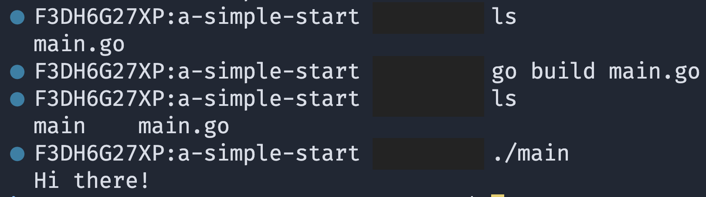

# A Simple Start

## Questions & Answers

1. **How do we run the code in our project?**  
   Use `go run` plus the name of the file you want to execute:
   ```sh
   go run main.go
   ```
   You can also use the Go CLI (Command Line Interface) tools:
   - `go build` — compiles one or more Go source code files  
     
   - `go run` — compiles and executes one or more files
   - `go fmt` — formats all the code in each file in the current directory
   - `go install` — compiles and "installs" a package
   - `go get` — downloads the raw source code of someone else's package
   - `go test` — runs any tests (test files) associated with the current project

2. **What does `package main` mean?**  
   A package is a collection of related source code files.
   - Each file ending with `.go`
   - The first line of each file must declare the package it belongs to, e.g., `package main`.

   Types of Packages: executable & reusable (dependency/helper)
   - The name of the package determines whether you are making an executable or a dependency package.
   - The `package main` defines a package that can be compiled and then *executed*. **It must have a function called `main`.**

3. **What does `import "fmt"` mean?**  
   Import statements allow your package to access code written in another package.
   - The `fmt` package, for example, is part of Go's standard library.
   - You can find documentation for standard library packages at [golang.org/pkg](https://golang.org/pkg).

4. **What's that `func` thing?**  
   The `func` keyword is used to declare a function:
   ```go
   func main() {
       // function content
   }
   ```

5. **How is the `main.go` file organized?**  
   - Package declaration
   - Import statements
   - Definition of the `main` function
   - Other helper functions, if needed